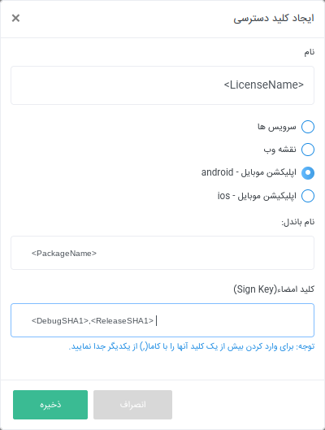

# Neshan Maps Android SDK

Neshan platform is providing map infrastructures. You can simply use the APIs and development kits in your [IOS](https://platform.neshan.org/sdk/ios-sdk), [Android](https://platform.neshan.org/sdk/android-sdk), [ReactJS](https://platform.neshan.org/sdk/web-sdk), [AngularJS](https://github.com/maherAshori/Neshan-Map) and [WordPress](https://platform.neshan.org/sdk/wordpress-addon) apps.

## Quickstart

First of all you need reterive a license for using the android sdk in your app and paste it in your project.

### 1. SHA1 Key

The SHA1 key of any sign key is unique; but there is a debug sign key in your system when you install the android studio; so you can use your shared (between your projects) debug sign key or your release sign key or both of them to use for reteriving license file from Neshan platform website.

just replace `/PATH/TO/SIGN/KEY` with path of your sign key and `<AliasOfSignKey>` with alias of that sign key.

* Release SHA1

```bash
#windows
keytool.exe -list -v -keystore 'PATH/TO/SIGN/KEY' -alias <AliasOfSignKey>

#Linux/Mac
keytool -list -v -keystore 'PATH/TO/SIGN/KEY' -alias <AliasOfSignKey>
```

* Debug SHA1

```bash
#windows
keytool.exe -list -v -keystore '~\.android\debug.keystore' -alias androiddebugkey -storepass android -keypass android

#Linux/Mac
keytool -list -v -keystore '~\.android\debug.keystore' -alias androiddebugkey -storepass android -keypass android
```

### 2. Reteriving License

Login to your account in [Neshan Platform](https://developers.neshan.org) then open [this page](https://developers.neshan.org/panel/access-token/index) and click on `ایجاد کلید دسترسی` button.
Now you can see this modal opened for you. just replace `<LicenseName>` with name that identified your license in the neshan panel and `<PackageName>` with pakcage name of your android project and enter your SHA1 keys from step one in `Sign Key` field sperated with comma (replace `<DebugSHA1>` and `<ReleaseSHA1>`).



After that just download your license and paste it in `app/main/res/raw/` folder of your android project.

### 3. Installation

First you need to add Neshan Maven repository to you `build.gradle (project)`

```groovy
allprojects {
  repositories {
    ...
    maven { url "https://maven.neshan.org/artifactory/public-maven" }
  }
}
```

Then you can add Neshan dpenendencies to your `build.grade (module:app)`

```groovy
dependencies {
    //Neshan sdk library
    implementation 'neshan-android-sdk:mobile-sdk:1.0.0'
    implementation 'neshan-android-sdk:services-sdk:1.0.0'
    implementation 'neshan-android-sdk:common-sdk:0.0.1'
    
    //Play Services
    implementation 'com.google.android.gms:play-services-gcm:16.1.0'
    implementation 'com.google.android.gms:play-services-location:17.0.0'
}
```

Be sure that you are using internet permission in your `AndroidManifest.xml` file:

```xml
<uses-permission android:name="android.permission.INTERNET"/>
```

**__Note:__**  if you are using progaurd in your project be sure that you are keeping Neshan sdk classes in your `proguard-rules.pro` file:

```
-keep class org.neshan.** {*;}
```

### 4. Usage

Define Neshan MapView in xml:

```xml
<org.neshan.mapsdk.MapView
    android:layout_width="match_parent"
    android:layout_height="match_parent"
    android:id="@+id/map"/>
```

For more information about the usage of Neshan Map SDK, please check out the [wiki](https://github.com/NeshanMaps/android-neshan-maps-starter/wiki) page.

If you needed any support about using the SDK or you had any problem; Please don't hesitate to [contacting us](https://platform.neshan.org/contact).
